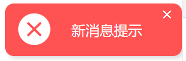
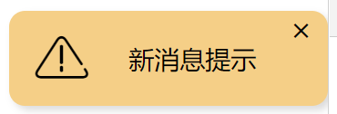
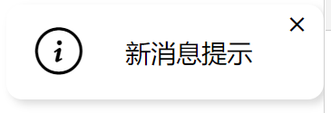
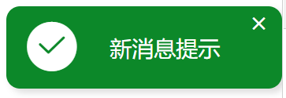
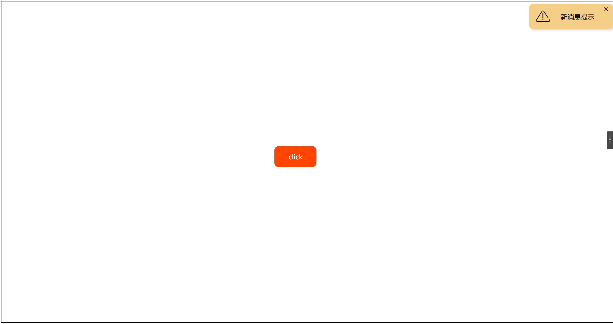

## v-toast plugin
🎀 date:  2021/2/16 ~ 2021/2/18

🎀 author: archks

🎀 description: vue消息提示插件


## Effects


<p align="middle">




</p>

<p align="middle">

</p>

## Usage

```bash
npm i -D toast-arch
```

main.js
```js
import toast from 'toast-arch'
Vue.use(toast)
```

trigger
```js
this.$toast({
    text: "新消息提示",
    width: 200,
    height: 60,
    autoClose: false,
    type: "warning",
    position: "topRight",
    callback: function () {
        console.log(" THis is Callback ");
    },
});
```


## Build Setup

``` bash
# install dependencies
npm install

# serve with hot reload at localhost:8080
npm run dev

# build for production with minification
npm run build
```

